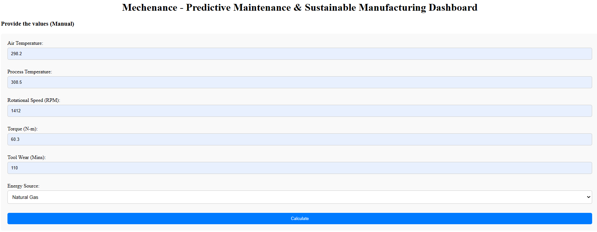
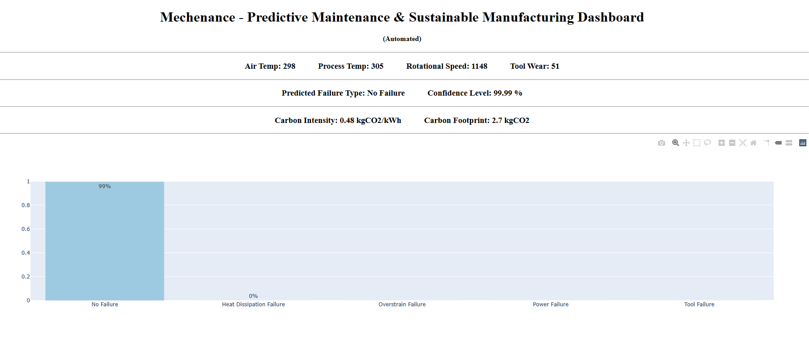

# Full Stack Projects
This repository contains the projects with full-stack applications along with backend codes using AI and ML.

## Project:1 Predictive Maintenance & Sustainable Development

This project aims to create a dashboard to predict the failure modes of a CNC milling machine based on the data collected from sensors. Along with that, it also shows the carbon footprint generated by the machine. The objective is to minimize maintenance costs and promote sustainable manufacturing.

## Dashboard

<p align="center">
  
</p>

<p align="center">
  
</p>


### Dependencies

Check the requirements.txt file to see the dependencies of Python libraries and packages.

### Executing program

* Create a virtual environment
  ```
  python3 -m venv myenv
  ```
* Activate the environment
  ```
  myenv\Scripts\activate
  ```
* Install the requirements. Make sure to clone the repository and the requirements.txt file exists in the current file path.
    ```
  pip install -r requirements.txt
  ```
* Run the app.py file
  ```
  python app.py
  ```
* Open the browser and open the local host or the IP address from the console output.
  ```
  http://localhost:5000/
  ```

## Authors

Contributors names and contact info

Harsh Bhatt [@harshbhatt99]

## Acknowledgments

Data Source: https://www.kaggle.com/datasets/shivamb/machine-predictive-maintenance-classification

